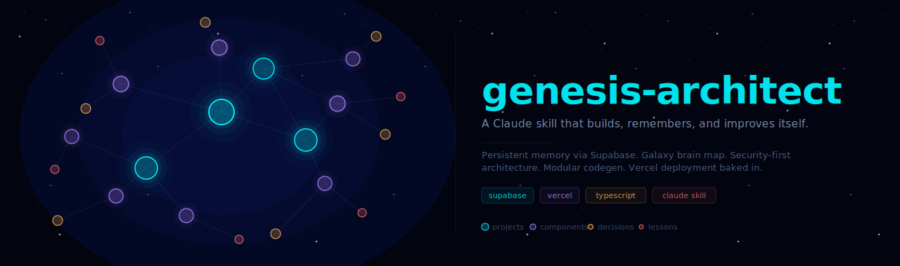

<div align="center">
  
</div>

<br/>

<div align="center">

[](https://claude.ai)
[](https://supabase.com)
[](https://vercel.com)

</div>

---

**genesis-architect** is a Claude skill that turns Claude into a self-improving engineering system. It builds modular projects with surgical precision, remembers everything across sessions via Supabase, generates a galaxy-style brain map of accumulated knowledge, thinks through security before shipping anything, and deploys to Vercel with a full CI/CD setup.

The core loop never stops:

```
BUILD → SHIP → EXTRACT LESSONS → STORE IN MEMORY → NEXT PROJECT STARTS SMARTER
```

---

## What it does

**Builds modular projects** — Chooses the right stack for the actual constraints, generates a clean folder structure before writing a single file, writes minimal code that a tired engineer can read at 2am.

**Never forgets** — Pulls a full knowledge snapshot from Supabase at the start of every session. Pushes extracted patterns, decisions, and lessons at the end. The next project inherits everything the last one taught.

**Galaxy brain map** — Generates a standalone `docs/brainmap.html` that renders all projects, components, decisions, and lessons as an interactive force-directed galaxy. Click any node to see full details. Hit Synthesize to get an AI-generated summary of accumulated patterns and next actions.

**Thinks like an attacker** — Before any deploy, runs through IDOR checks, input validation coverage, rate limit surface area, secret exposure in the client bundle, and a full threat model. Ships nothing it hasn't tried to break.

**Deploys with CI/CD** — Vercel + Supabase setup with branching preview environments, GitHub Actions for type-check and audit, and a post-deploy verification checklist.

---

## File structure

```
genesis-architect/
├── SKILL.md                       Main skill — 7-phase build protocol
├── references/
│   ├── memory-schema.md           Supabase schema, TypeScript types, sync operations
│   ├── brainmap.md                Galaxy visualization spec and generation script
│   ├── security.md                6-layer security framework with threat model template
│   └── vercel-deploy.md           Full deployment guide with CI/CD and Supabase branching
└── assets/
    └── galaxy-template.html       Standalone brain map HTML (inject __GRAPH_DATA__ to use)
```

---

## Install

### Option 1 — Upload the `.skill` file

Download `genesis-architect.skill` from [Releases](../../releases) and upload it directly to Claude.ai under Settings → Skills.

### Option 2 — Build from source

Clone this repo, then point your Claude skill loader at the `genesis-architect/` directory.

```bash
git clone https://github.com/your-username/genesis-architect.git
```

---

## Quickstart

Once installed, the skill activates automatically when you say anything like:

- `build me a SaaS product for X`
- `what have we built so far`
- `show me the brain map`
- `make it secure before we ship`
- `set up Vercel and Supabase`
- `I need a modular API for Y`

No explicit trigger phrase needed — the skill recognizes intent from context.

---

## Memory setup (Supabase)

The skill expects four tables in your Supabase project. Run this once:

```bash
# 1. Create a Supabase project at supabase.com
# 2. Open the SQL editor and paste the schema from:
open genesis-architect/references/memory-schema.md
# 3. Set your environment variables
cp .env.example .env.local
```

The schema creates `genesis_projects`, `genesis_components`, `genesis_decisions`, and `genesis_lessons` — all with RLS enabled. The skill uses the service role key server-side; the anon key is never exposed to client code.

---

## Brain map setup

```bash
# Copy the template
cp assets/galaxy-template.html memory/brainmap-template.html

# Sync memory from Supabase and generate the map
npx tsx memory/sync.ts --generate-map

# Open it
open docs/brainmap.html
```

After deploying to Vercel, the brain map is accessible at `/map`.

---

## How the memory loop works

At the start of every session:
1. `sync.ts` pulls the full knowledge state from Supabase into `memory/brain.json`
2. Relevant context is loaded for the current project

At the end of every session (or at any milestone):
1. New reusable patterns are extracted and added to the Component Library
2. Architectural forks are logged to the Decision Log with full reasoning
3. Anything that broke is recorded as a Lesson with root cause and prevention
4. All new entries are pushed to Supabase
5. `brainmap.html` is regenerated to reflect the updated graph

Nothing is lost. The system compounds.

---

## Design principles baked in

The skill is opinionated about how code gets written. These are non-negotiable:

- No file is created without a clear single reason to exist
- Environment variables are validated at startup — the server refuses to start if any are missing
- Every server route verifies resource ownership, not just authentication
- Zod validates every trust boundary — HTTP bodies, query params, file uploads, webhook payloads
- `npm audit` passes before any deploy — no high or critical vulnerabilities ship
- RLS is enabled on every Supabase table without exception

And one stylistic rule that carries through everything:

> Write for the engineer reading this at 2am, not for the LLM that generated it.

---

## Contributing

This is a skill file, not an application. Improvements should be tested by actually triggering the skill and evaluating whether the output quality improves. The most useful contributions are:

- Additional security patterns with real CVE references
- Component library entries from production use
- Decision log entries with observed outcomes
- Edge cases in the stack selection logic

Open a PR with the specific SKILL.md or reference file change and a description of what behavior it improves.

---

<div align="center">
<sub>genesis-architect — built with <a href="https://claude.ai">Claude</a></sub>
</div>
